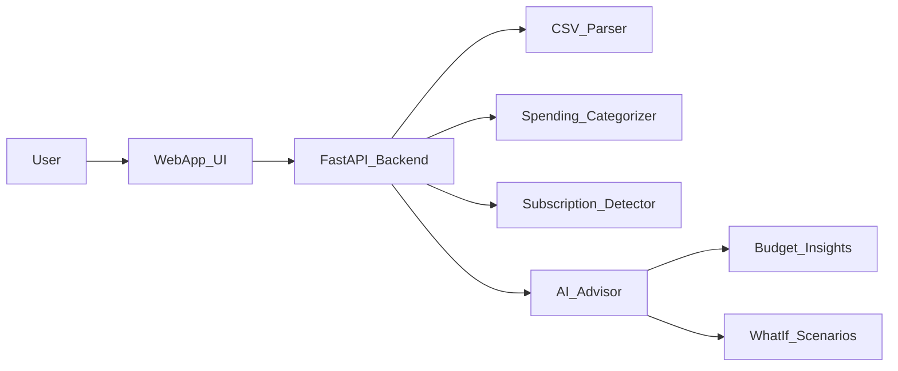

# TartanHacks Project & Strategy Plan

## Overview

You already have a strong Ripple idea (RippleEcoPay). To maximize your odds of winning, it’s smart to consider 1–2 alternative ideas that:

- Aim squarely at a **sponsor prize with clear requirements** (Visa, Conway, Ripple, etc.)
- Are **Python-friendly** and easy to demo end‑to‑end in a weekend
- Naturally touch **2–3 house tracks** (cross‑field, sustainability, social impact, decision support)

Below are the top candidate ideas (including RippleEcoPay), with confidence scores and how they fit the tracks.

## Candidate Ideas & Confidence

### 1. VisaWise – Intelligent Student Budget Co‑Pilot (Visa + Capital One + Conway)

- **Confidence**: **9.0/10** (higher than RippleEcoPay due to simpler stack and no blockchain risk).
- **Core idea**: A smart budgeting tool for students that ingests bank/transaction exports (CSV or mocked data), auto‑categorizes spending (food, rent, subscriptions, rideshare, etc.), detects recurring charges, and generates **personalized, actionable guidance** ("cancel X subscription, shift Y to savings, you can hit Z goal in 3 months").
- **Tracks**:
- **Visa sponsor prize**: Exactly matches "Intelligent Budget Planner" language.
- **Capital One – Best financial hack**: Strong contender as a polished, practical finance tool.
- **Conway – AI for decision support**: "Should I cancel this subscription? Rent here or live with roommates?" scenarios powered by simple models + LLM explanations.
- **Polychrome Mosaic**: Finance + AI + student life/education.
- **Why it’s high confidence**:
- Pure Python + simple React; no ledger or hardware.
- You can fully control the data (mock bank CSVs), so the demo is reliable.
- Clear, visual demo: before/after budget, insights cards, scenario sliders.

### 2. RippleEcoPay – Climate Micro‑Donations on XRP (Ripple + Sustainability)

- **Confidence**: **8.5/10** (already strong; primary for Ripple sponsor track).
- **Core idea**: Let users send tiny XRP micro‑donations (e.g., $0.25–$1.00) to vetted climate projects, with AI‑powered project recommendations and **impact simulations** (e.g., "this offsets 5kg CO₂, like skipping a 10km car ride").
- **Tracks**:
- **Ripple sponsor prize**: Direct fit (real XRP Ledger usage + real‑world impact).
- **Polychrome Mosaic**: Finance (blockchain) + sustainability + AI.
- **Emerald Tile / First Penguin**: Climate & sustainability‑focused, plus some risk from blockchain angle.
- **Why slightly lower confidence than VisaWise**:
- XRP Ledger integration & wallet UX add complexity and possible demo flakiness.
- Still excellent if you’re excited about crypto and prepared to invest effort into ledger tooling.

### 3. PathAdvisor – AI Decision Co‑Pilot for Courses & Careers (Conway + Polychrome)

- **Confidence**: **8.3/10**.
- **Core idea**: An AI decision-support tool for students choosing **courses, internships, and side projects**. Users specify their interests (research, startups, FAANG, grad school), constraints (time, GPA, stress), and PathAdvisor suggests **concrete plans** ("take X + Y this semester, apply to Z orgs, do project type Q"), explaining tradeoffs.
- **Tracks**:
- **Conway – Best AI for decision support**: Direct hit (multi‑criteria decision support with explainability).
- **Polychrome Mosaic**: Education + careers + AI.
- **Community Mural**: Societal impact in helping students make better life decisions.
- **Why it’s strong but slightly behind VisaWise**:
- Less tightly linked to a sponsor prize with explicit rubric than Visa or Ripple.
- Harder to objectively measure "success" vs a budget planner with clear numbers.

### 4. Others (Lower Confidence / Niche)

- **AppLovin 15KB browser game**: Fun but very JS‑ and optimization‑heavy, less aligned with your Python strength; confidence ~6.5/10.
- **Hardware hack (Roboclub)**: Great if you have hardware access/experience; risky otherwise.
- **No‑AI product for Hand‑cut Tesserae**: Could be winnable but would ignore your AI strength; better as a backup if sponsor tracks feel overcrowded.

## Recommended Direction

**Primary recommendation**:

- Pursue **VisaWise (Intelligent Student Budget Co‑Pilot)** as your main track (Visa + Capital One + Conway), with a clear plan to:
- Ingest/parse CSV bank statements or mocked data.
- Auto‑categorize spending (rule‑based + a tiny ML model if time).
- Detect subscriptions/recurring charges.
- Provide AI‑generated insights and "what‑if" scenarios (decision support).

**Secondary option**:

- If your team is more excited about blockchain and okay with the extra risk, stick with **RippleEcoPay** as the main project and keep **VisaWise** as a back‑up concept you could pivot to if XRP tooling proves painful early.

## High-Level Implementation Approach (VisaWise)

If you choose VisaWise, a simple, Python‑first architecture could look like this:

- **Backend (Python/FastAPI)**
- Endpoints: `/upload-transactions`, `/insights`, `/scenarios`.
- Logic modules: `parser.py` (CSV → normalized transactions), `categorizer.py` (merchant → category), `subscriptions.py` (recurring pattern detection), `advisor.py` (rules + LLM to phrase advice).
- **Frontend (simple React or even a single‑page app)**
- Views:
    - Upload screen: drag‑and‑drop CSV + sample data button.
    - Dashboard: category pie chart, monthly timeline, subscription list.
    - Insights feed: cards like "You spend 3× more on rideshare than peers" with recommended actions.
    - Scenario slider: "If I cut food delivery by 20%…" → live update to savings.
- **AI usage**
- Use a small ML model or even heuristics for classification to keep it deterministic.
- Use Claude/GPT to turn numbers into **tight, human‑readable advice** (Visa/Conway love this "explainable AI" angle).

## High-Level Implementation Approach (RippleEcoPay)

If you instead go with RippleEcoPay:

- Python FastAPI backend with `xrpl-py` for testnet payments, plus a small recommendation module for climate projects.
- Frontend showing user preferences → recommended project → XRP micro‑donation → impact visualization + ledger link.
- AI used mainly for impact messaging and possibly matching donor preferences to projects.