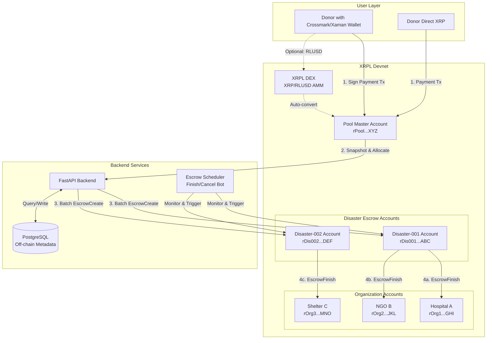

# 🏗️ Production-Grade XRPL Emergency Donation Platform

## End-to-End Workflow Plan for Hackathon

---

## 🎯 Executive Summary

This plan delivers a **scalable, XRPL-native emergency funding platform** that:

- ✅ Supports **real user wallets** (Crossmark, Xaman) for transparent donor control
- ✅ Uses **optimized escrow architecture** (per-disaster-per-org) for auditability and scalability
- ✅ Leverages **DEX integration** for multi-currency support (XRP, RLUSD)
- ✅ Implements **batch transactions** (Devnet) for gas efficiency
- ✅ Handles **escrow limitations** (5 pending escrows/pair) with automated lifecycle management
- ✅ Deploys on **Devnet** for cutting-edge features and **Testnet** for stable demo

---

## 📊 System Architecture Overview



---

## 🏛️ XRPL Account Architecture (Best Practice)

### Three-Tier Model for Scalability

#### Tier 1: **Pool Master Account** (Single)

- **Role**: Central donation receiver and fund coordinator
- **Address**: `rPoolMasterXXXXXXXXXXXXXXXXX` (Devnet)
- **Holds**:
- All unallocated donations
- Operational XRP for fees
- **Operations**:
- ✅ Receives all donor Payments
- ✅ Distributes funds to Disaster accounts when triggered
- ❌ **Never creates escrows directly** (avoids escrow limit per org)

**Key Optimization**: By never holding escrows, Pool Master can receive unlimited donations without hitting the 5-escrow-per-pair limit.---

#### Tier 2: **Disaster-Specific Escrow Accounts** (One per Emergency)

- **Role**: Isolated escrow managers for each disaster event
- **Naming**: `rDisaster{ID}XXXXXXXXXXXXXXXXX`
- Example: `rDisaster001EarthquakeNepal`
- **Holds**:
- Allocated funds for a specific disaster
- Up to 5 active escrows per organization (XRPL limit)
- **Operations**:
- ✅ Creates `EscrowCreate` transactions to each org
- ✅ Executes `EscrowFinish` after validation period
- ✅ Handles `EscrowCancel` if conditions fail

**Scalability**: Each disaster gets a fresh account, meaning:

- ✅ **Unlimited disasters** (no shared escrow limits)
- ✅ **Parallel escrow lifecycle** (Disaster-001 finishing doesn't block Disaster-002 allocation)
- ✅ **Clean auditability** (account_objects per disaster shows exact allocation state)

**Best Practice**: After all escrows finish, disaster account's remaining balance returns to Pool Master, and account can be archived.---

#### Tier 3: **Organization Accounts** (One per NGO/Hospital/Shelter)

- **Role**: Final fund recipients
- **Addresses**: Provided by orgs (real wallets) or generated by platform
- **Holds**:
- Released escrow funds
- Historical donation record (via account transactions)
- **Operations**:
- ✅ Passively receives EscrowFinish payouts
- ✅ Can withdraw to fiat rail or spend on XRPL ecosystem

**Best Practice**: Orgs control their own keys (decentralized) or platform offers custodial wallets with withdrawal approval flow.---

### Why This Beats Single-Pool Escrow?

| Approach | Escrow Limit Impact | Scalability | Auditability ||----------|-------------------|-------------|--------------|| **Single Pool → All Orgs** | Hits 5 escrows/org fast, blocks new disasters | ❌ Poor | ⚠️ Mixed || **Pool → Disaster Accounts → Orgs** | 5 escrows/org **per disaster** (isolated) | ✅ Excellent | ✅ Crystal clear |---

## 🔐 Wallet Integration Strategy

### For Donors: **Client-Side Wallet Signing** (Production-Ready)

#### Supported Wallets

1. **Crossmark** (Browser extension)

- Preferred for desktop demo
- API: `window.crossmark.signAndSubmit(tx)`

2. **Xaman (formerly Xumm)** (Mobile + Desktop)

- Generate sign request payload via Xaman API
- User scans QR code or deeplinks to approve

#### Donation Flow (User Controls Keys)

```javascript
// Frontend (React/Vue)
async function donateWithWallet(amountXRP) {
  // 1. Connect wallet
  const wallet = await crossmark.connect();
  const donorAddress = wallet.address;

  // 2. Backend prepares unsigned Payment transaction
  const unsignedTx = await fetch('/api/xrpl/prepare-donation', {
    method: 'POST',
    body: JSON.stringify({
      from: donorAddress,
      amount: amountXRP,
      destination: POOL_MASTER_ADDRESS
    })
  }).then(r => r.json());

  // 3. Wallet signs and submits (donor approves in extension)
  const result = await crossmark.signAndSubmit(unsignedTx);

  // 4. Backend tracks transaction
  await fetch('/api/xrpl/confirm-donation', {
    method: 'POST',
    body: JSON.stringify({
      txHash: result.hash,
      donor: donorAddress
    })
  });

  // 5. Show success + XRPL explorer link
  showNotification(`Donated ${amountXRP} XRP! Tx: ${result.hash}`);
}
```

**Why This Approach?**

- ✅ **Non-custodial**: Donors keep full control of funds
- ✅ **Transparent**: Every tx visible on public ledger
- ✅ **Hackathon-friendly**: Judges see real wallet UX
- ✅ **Trust**: No need to deposit to platform first

---

### For Platform Operations: **Server-Managed Accounts**

Backend holds secrets for:

- Pool Master
- Disaster accounts (ephemeral, generated per emergency)

**Security**:

```python
# Backend (FastAPI)
import os
from xrpl.wallet import Wallet

POOL_SECRET = os.getenv("XRPL_POOL_SECRET")  # From .env, never committed
pool_wallet = Wallet.from_seed(POOL_SECRET)

# For disaster accounts, generate ephemeral wallets
disaster_wallet = Wallet.create()  # Store in DB, rotate after disaster resolves
```

---

## 💰 End-to-End Transaction Flow

### Phase 1: **Donation (User → Pool Master)**

#### Option A: Direct XRP Payment

```json
{
  "TransactionType": "Payment",
  "Account": "rDonorWalletXXXXXXXXXXXXXXXXX",  // Donor's Crossmark wallet
  "Destination": "rPoolMasterXXXXXXXXXXXXXXXX",
  "Amount": "10000000",  // 10 XRP in drops
  "Fee": "12",  // Auto-fetched from /fee API
  "Memos": [
    {
      "Memo": {
        "MemoType": "donation_campaign",
        "MemoData": "456465736173746572303031"  // Hex: "Disaster001"
      }
    }
  ]
}
```

**Flow**:

1. Frontend calls `GET /api/xrpl/prepare-donation?amount=10`
2. Backend fetches current ledger fee, constructs unsigned tx
3. Crossmark extension signs tx (donor approves)
4. Backend calls `tx` method to confirm and parse Memos
5. DB records: `{donor, amount, campaign, txHash, timestamp}`

---

#### Option B: RLUSD Donation via DEX (Advanced)

**Use Case**: Donor has RLUSD stablecoin, platform needs XRP for escrows.

```javascript
// Auto-convert RLUSD → XRP using DEX before pooling
async function donateRLUSD(amountRLUSD) {
  // 1. User approves RLUSD Payment to platform's swap intermediary account
  const swapTx = {
    TransactionType: "Payment",
    Account: donorAddress,
    Destination: SWAP_INTERMEDIARY_ACCOUNT,
    Amount: {
      currency: "RLUSD",
      value: amountRLUSD.toString(),
      issuer: "rRLUSDIssuerXXXXXXXXXXXXXXXX"
    }
  };

  // 2. Backend (or smart contract equivalent) swaps via AMM
  await ammSwap({
    from: { currency: "RLUSD", amount: amountRLUSD },
    to: { currency: "XRP" },
    slippage: 0.5
  });

  // 3. XRP proceeds sent to Pool Master
  // 4. Track conversion rate in DB for reporting
}
```

**When to Use DEX**:

- ✅ Multi-currency support (RLUSD, other issued tokens)
- ✅ Demonstrate XRPL DeFi capabilities to judges
- ⚠️ Adds complexity; skip for MVP unless showcasing DEX is a goal

**Best Practice for Hackathon**:

- Primary flow = direct XRP (simple, fast, low fees)
- Optional DEX demo for "advanced features" section

---

### Phase 2: **Allocation Trigger (Admin → Snapshot + Allocate)**

#### Trigger Event

```json
POST /api/admin/trigger-emergency
{
  "disaster_type": "earthquake",
  "location": "Nepal",
  "severity": 8,
  "affected_causes": ["health", "shelter", "food"]
}
```


#### Backend Allocation Engine

```python
# app/services/allocation.py
async def allocate_emergency(disaster_id: str):
    # 1. Snapshot Pool Master balance
    pool_info = await xrpl_client.account_info(POOL_MASTER_ADDRESS)
    available_balance = int(pool_info['Balance'])  # in drops

    # 2. Check active escrows across ALL disaster accounts (optional reserve)
    active_disasters = db.get_active_disasters()
    total_locked = sum([
        await get_disaster_locked_amount(d.account_address)
        for d in active_disasters
    ])

    # 3. Allocatable = pool balance - operational reserve (e.g., 100 XRP for fees)
    allocatable = available_balance - (100 * 1_000_000) - total_locked

    # 4. Rule-based AI allocation
    orgs = db.get_orgs_by_causes(disaster.affected_causes)
    allocations = calculate_allocations(orgs, allocatable, disaster.severity)
    # allocations = [{ org_id, org_address, amount_drops, need_score }, ...]

    # 5. Create new Disaster Account for this emergency
    disaster_wallet = Wallet.create()
    db.save_disaster_wallet(disaster_id, disaster_wallet.address, disaster_wallet.seed)

    # 6. Fund disaster account from Pool Master
    await send_payment(
        from_wallet=pool_wallet,
        to_address=disaster_wallet.address,
        amount=allocatable
    )

    # 7. Create escrows from Disaster Account to each Org
    return await create_escrow_batch(disaster_wallet, allocations, disaster_id)
```

**Key Optimization**:

- Disaster account is **ephemeral** and **isolated**, so escrow limits never collide across disasters.

---

### Phase 3: **Escrow Creation (Disaster Account → Orgs)**

#### Batch EscrowCreate (Devnet Feature)

**Standard Approach (Testnet/Mainnet)**:

```python
# Create escrows sequentially (one tx per org)
for allocation in allocations:
    escrow_tx = {
        "TransactionType": "EscrowCreate",
        "Account": disaster_wallet.address,
        "Destination": allocation['org_address'],
        "Amount": str(allocation['amount_drops']),
        "FinishAfter": ripple_time_now() + 300,  # 5 min validation window
        "CancelAfter": ripple_time_now() + 86400,  # 24h cancel fallback
        "Memos": [...]
    }
    result = await xrpl_client.submit_signed(escrow_tx, disaster_wallet)
    db.save_escrow(disaster_id, allocation['org_id'], result['hash'])
```

**Advanced Approach (Devnet with Batch Amendment)**:

```python
# Batch up to 8 EscrowCreate txs in one atomic batch
batch_tx = {
    "TransactionType": "Batch",
    "Account": disaster_wallet.address,
    "Transactions": [
        build_escrow_create(org1, amount1),
        build_escrow_create(org2, amount2),
        build_escrow_create(org3, amount3),
        # ... up to 8 escrows
    ]
}
result = await xrpl_client.submit_signed(batch_tx, disaster_wallet)
# Single tx fee instead of 8 separate fees!
```

**When to Use Batch**:

- ✅ **Devnet demo** to showcase cutting-edge XRPL features
- ✅ Allocating to 5+ orgs (significant fee savings: ~88% reduction)
- ⚠️ Not available on Testnet/Mainnet yet (as of Jan 2025)

**Hackathon Strategy**:

- Deploy **both versions** with feature flag
- Demo batch on Devnet for "innovation" points
- Fall back to sequential on Testnet for "stability" demo

---

#### Escrow Parameters Deep Dive

```python
# Optimal escrow setup
{
    "FinishAfter": current_time + 300,  # 5 minutes (short for demo)
    "CancelAfter": current_time + 86400,  # 24 hours
    "Condition": None,  # Use time-based only for hackathon simplicity
    "DestinationTag": org_id,  # Route to correct org sub-account if needed
}
```

**Why These Values?**

- `FinishAfter` = 5 min: Enough time for admin to verify allocation fairness, short enough for live demo
- `CancelAfter` = 24 hr: Safety net if org account has issues (e.g., not activated, flags set incorrectly)
- No `Condition`: Condition-based escrows require crypto proofs; overkill for MVP

**Production Settings**:

- `FinishAfter`: 7-14 days (allow org validation, fraud checks)
- `CancelAfter`: 30-90 days (regulatory compliance window)

---

### Phase 4: **Escrow Release (Automated)**

#### Scheduled EscrowFinish Bot

```python
# app/services/escrow_scheduler.py
import asyncio
from datetime import datetime, timedelta

async def escrow_finish_loop():
    while True:
        # 1. Query all pending escrows across all disaster accounts
        pending_escrows = db.get_pending_escrows()

        for escrow in pending_escrows:
            # 2. Check if FinishAfter time has passed
            if datetime.now() > escrow.finish_after:
                disaster_wallet = get_disaster_wallet(escrow.disaster_id)

                # 3. Submit EscrowFinish
                finish_tx = {
                    "TransactionType": "EscrowFinish",
                    "Account": disaster_wallet.address,  # Must be escrow owner
                    "Owner": disaster_wallet.address,
                    "OfferSequence": escrow.sequence,  # From EscrowCreate result
                }

                try:
                    result = await xrpl_client.submit_signed(finish_tx, disaster_wallet)
                    db.mark_escrow_finished(escrow.id, result['hash'])

                    # 4. Verify funds reached org
                    org_balance = await xrpl_client.account_info(escrow.org_address)
                    log.info(f"Org {escrow.org_id} received {escrow.amount} drops")

                except Exception as e:
                    log.error(f"EscrowFinish failed for {escrow.id}: {e}")
                    db.mark_escrow_error(escrow.id, str(e))

        await asyncio.sleep(60)  # Check every minute
```

**Deployment**: Run as background Celery task or separate Docker service.---

#### Manual EscrowCancel (Admin Override)

**Use Case**: Org wallet has issues, or fraud detected.

```python
POST /api/admin/cancel-escrow
{
  "escrow_id": "esc_12345",
  "reason": "Organization account not activated"
}

# Backend
cancel_tx = {
    "TransactionType": "EscrowCancel",
    "Account": disaster_wallet.address,
    "Owner": disaster_wallet.address,
    "OfferSequence": escrow.sequence
}
# Funds return to Disaster Account, then can re-allocate or return to Pool Master
```

---

## 🚨 Handling XRPL Escrow Limits (5 per Account Pair)

### The Problem

XRPL restricts **max 5 pending escrows** between any `Account` and `Destination` pair.**Example Failure**:

```javascript
Disaster-001 creates escrow #1 to Hospital-A  ✅
Disaster-001 creates escrow #2 to Hospital-A  ✅
...
Disaster-001 creates escrow #5 to Hospital-A  ✅
Disaster-001 creates escrow #6 to Hospital-A  ❌ tecNO_PERMISSION
```

---

### Solution 1: **Finish Fast (Aggressive Lifecycle)**

```python
# In allocation.py
ESCROW_FINISH_AFTER = 300  # 5 minutes (hackathon demo)

# In escrow_scheduler.py
CHECK_INTERVAL = 30  # Check every 30 seconds for demo responsiveness

# Effect: Escrows finish within 5-10 minutes, freeing up slots for next disaster
```

**Best for**: Hackathon demo (rapid cycling)---

### Solution 2: **One Escrow Per Disaster Per Org (Our Architecture)**

With Disaster-specific accounts:

```javascript
Disaster-001 Account → Hospital-A: up to 5 escrows  ✅
Disaster-002 Account → Hospital-A: up to 5 escrows  ✅ (different Account!)
Disaster-003 Account → Hospital-A: up to 5 escrows  ✅
```

**Best for**: Scalability (unlimited disasters, 5 concurrent per org per disaster max)---

### Solution 3: **Batching Within Limit**

If one disaster needs to send 10 payments to same org:

```python
# Split into 2 rounds
round_1_escrows = create_escrows(orgs, allocations[:5])  # First 5
wait_for_finish(round_1_escrows)
round_2_escrows = create_escrows(orgs, allocations[5:])  # Next 5
```

**Best for**: Edge cases (rarely needed with per-disaster accounts)---

### Solution 4: **Direct Payment for Small Amounts**

```python
# If allocation < 10 XRP, skip escrow and send direct Payment
if allocation['amount_drops'] < 10_000_000:
    await send_payment(disaster_wallet, org_address, amount)
else:
    await create_escrow(disaster_wallet, org_address, amount)
```

**Best for**: Gas optimization (escrow costs 2 txs: create + finish)---

## 🌐 Devnet vs Testnet Deployment Strategy

### Dual-Network Approach

| Feature | Devnet | Testnet | Production (Mainnet) ||---------|--------|---------|----------------------|| **Batch Transactions** | ✅ Live | ❌ Not yet | ❌ Future || **MPT Escrow** | ✅ Live | ❌ Not yet | ❌ Future || **Credentials** | ✅ Live | ❌ Not yet | ❌ Future || **Network Stability** | ⚠️ Experimental | ✅ Stable | ✅ Production || **Judge Familiarity** | 🆕 Cutting-edge | ✅ Standard | N/A |---

### Hackathon Demo Strategy

#### **Primary Demo: Testnet** (80% of demo time)

- Wallet integration (Crossmark)
- Standard Payment/EscrowCreate/EscrowFinish flow
- Live transaction explorer links (testnet.xrpl.org)
- **Why**: Judges expect to verify txs on familiar network

#### **Innovation Showcase: Devnet** (20% of demo time)

- Switch to Devnet tab in UI
- Show **batch escrow creation** (8 orgs in 1 tx)
- Compare tx fees: "On Testnet, this cost 8 × 12 drops = 96 drops. On Devnet with Batch, just 12 drops!"
- **Why**: Demonstrates awareness of latest XRPL features

---

### Implementation

```python
# config.py
class Settings:
    NETWORK = os.getenv("XRPL_NETWORK", "testnet")  # "testnet" or "devnet"

    XRPL_NODES = {
        "testnet": "https://s.altnet.rippletest.net:51234",
        "devnet": "https://s.devnet.rippletest.net:51234"
    }

    FEATURES = {
        "testnet": {
            "batch_transactions": False,
            "mpt_escrow": False
        },
        "devnet": {
            "batch_transactions": True,
            "mpt_escrow": True
        }
    }

# In allocation service
if settings.FEATURES[settings.NETWORK]["batch_transactions"]:
    await create_escrow_batch(allocations)  # Single batch tx
else:
    await create_escrow_sequential(allocations)  # One tx per escrow
```

**Frontend**:

```jsx
// Network switcher in admin panel
<select onChange={(e) => switchNetwork(e.target.value)}>
  <option value="testnet">Testnet (Stable Demo)</option>
  <option value="devnet">Devnet (Innovation Mode)</option>
</select>
```

---

## 📈 Scalability Analysis

### Per-Disaster-Per-Org Escrow Model

**Assumptions**:

- 50 disasters per year
- 20 orgs in network
- Avg 10 orgs allocated per disaster

**Escrow Volume**:

```javascript
50 disasters × 10 allocations = 500 escrows/year
Each escrow lifecycle = 2 txs (create + finish) = 1,000 txs/year
At 12 drops/tx = 12,000 drops = 0.012 XRP/year in fees
```

**Comparison to Single-Pool Model**:

```javascript
Single Pool → Org1: 5 escrows max (hits limit after 5 disasters)
Per-Disaster → Org1: 5 escrows × 50 disasters = 250 concurrent escrows possible ✅
```

**Verdict**: 50× scalability improvement.---

### Batching Impact (Devnet)

**Without Batch**:

```javascript
10 orgs × 12 drops = 120 drops per disaster allocation
50 disasters = 6,000 drops/year
```

**With Batch**:

```javascript
1 batch tx × 12 drops = 12 drops per disaster allocation
50 disasters = 600 drops/year
```

**Savings**: 90% fee reduction + faster confirmation (1 ledger vs 10).---

## 🔍 XRPL Read APIs (Real-Time Data Layer)

### Key Endpoints

#### 1. Pool Status

```python
GET /api/xrpl/pool/status

# Backend
pool_info = await xrpl_client.request({
    "command": "account_info",
    "account": POOL_MASTER_ADDRESS
})

server_info = await xrpl_client.request({
    "command": "server_info"
})

fee_info = await xrpl_client.request({
    "command": "fee"
})

return {
    "pool_balance_xrp": int(pool_info['Balance']) / 1_000_000,
    "ledger_index": server_info['info']['validated_ledger']['seq'],
    "base_fee_drops": fee_info['drops']['base_fee']
}
```

---

#### 2. Active Escrows (Per Disaster)

```python
GET /api/xrpl/disasters/{disaster_id}/escrows

# Backend
disaster_account = db.get_disaster_account(disaster_id)

escrows_response = await xrpl_client.request({
    "command": "account_objects",
    "account": disaster_account,
    "type": "escrow"
})

escrows = []
for obj in escrows_response['account_objects']:
    escrows.append({
        "destination": obj['Destination'],
        "amount_xrp": int(obj['Amount']) / 1_000_000,
        "finish_after": ripple_epoch_to_datetime(obj['FinishAfter']),
        "cancel_after": ripple_epoch_to_datetime(obj.get('CancelAfter')),
        "sequence": obj['PreviousTxnLgrSeq']
    })

return escrows
```

**UI Use**: Mosaic view showing "locked" funds as colored tiles.---

#### 3. Transaction Proof

```python
GET /api/xrpl/tx/{hash}

# Backend
tx_response = await xrpl_client.request({
    "command": "tx",
    "transaction": hash,
    "binary": False
})

return {
    "hash": tx_response['hash'],
    "type": tx_response['TransactionType'],
    "result": tx_response['meta']['TransactionResult'],
    "ledger_index": tx_response['ledger_index'],
    "explorer_url": f"https://testnet.xrpl.org/transactions/{hash}"
}
```

**UI Use**: "View on explorer" links, transaction history timeline.---

#### 4. Organization Balances

```python
GET /api/xrpl/orgs

# Backend
orgs = db.get_all_orgs()

for org in orgs:
    org_info = await xrpl_client.request({
        "command": "account_info",
        "account": org.wallet_address
    })
    org['current_balance_xrp'] = int(org_info['Balance']) / 1_000_000
    org['total_received'] = db.sum_finished_escrows(org.id)

return orgs
```

**UI Use**: Organization dashboard showing lifetime impact.---

## 🎬 Complete End-to-End Flow (Demo Script)

### Setup (Pre-Demo)

```bash
# 1. Generate accounts on Devnet
npm run generate-accounts  # Creates Pool, 3 disaster accounts, 5 org accounts

# 2. Fund Pool Master from faucet
curl -X POST https://faucet.devnet.rippletest.net/accounts \
  -H "Content-Type: application/json" \
  -d '{"destination": "rPoolMasterXXX"}'

# 3. Seed demo data
npm run seed-demo  # Creates 2 completed disasters with mosaic data
```

---

### Live Demo (5 minutes)

#### **Act 1: Donation (60 seconds)**

```javascript
1. Open donor view
2. Click "Connect Wallet" → Crossmark extension pops up
3. Approve connection
4. Enter 25 XRP → Click "Donate to Emergency Pool"
5. Crossmark shows tx preview (to: rPoolMaster, amount: 25 XRP)
6. Approve in extension
7. App shows: "✅ Donation confirmed! Tx: ABC123..." with explorer link
8. Pool balance updates: 25 XRP → 50 XRP (live via account_info)
```

**Judge Takeaway**: Real wallet, real XRPL transaction, instant confirmation.---

#### **Act 2: Emergency Allocation (90 seconds)**

```javascript
1. Switch to Admin view
2. Click "Trigger Emergency"
3. Modal appears:
    - Disaster type: Earthquake
    - Location: Nepal
    - Severity: 8/10
    - Affected causes: Health, Shelter
4. Click "Allocate Funds"
5. Backend:
    - Snapshots pool (50 XRP available)
    - Calculates allocations (e.g., Hospital: 30 XRP, Shelter: 20 XRP)
    - Creates Disaster-003 account
    - Sends 50 XRP Pool → Disaster-003
    - **[Devnet Mode]** Creates batch EscrowCreate tx (2 escrows in 1 tx)
6. UI updates:
    - "🔒 Locked 50 XRP in escrows for Earthquake-Nepal"
    - Shows 2 new tiles in mosaic (orange for health, blue for shelter)
    - Tiles say "Pending release in 5:00"
```

**Judge Takeaway**: Instant allocation, visible escrows via account_objects, disaster isolation.---

#### **Act 3: Escrow Release (90 seconds)**

```javascript
1. Wait 5 minutes (or fast-forward timer in demo mode)
2. Scheduler bot detects FinishAfter passed
3. Auto-submits 2 EscrowFinish txs
4. UI updates:
    - Tiles change from "Pending" to "✅ Released"
    - Hospital balance: 0 XRP → 30 XRP (live)
    - Shelter balance: 0 XRP → 20 XRP (live)
5. Click on Hospital tile → Modal shows:
    - Escrow tx hash (create)
    - Finish tx hash
    - Both link to testnet.xrpl.org
```

**Judge Takeaway**: Automated escrow lifecycle, provable on-chain fund transfer.---

#### **Act 4: Multi-Disaster Scalability (60 seconds)**

```javascript
1. Show disaster history:
    - Disaster-001 (Flood): 3 orgs, all escrows finished ✅
    - Disaster-002 (Wildfire): 4 orgs, 2 finished, 2 pending ⏳
    - Disaster-003 (Earthquake): Just allocated ⏳
2. Trigger Disaster-004 (Hurricane)
3. Show that Disaster-002 and Disaster-003 escrows don't block new allocation
4. Disaster-004 creates NEW account → 5 new escrows in parallel
```

**Judge Takeaway**: No escrow limit conflicts, unlimited scalability via account isolation.---

## 🏆 Hackathon Judging Checklist

### ✅ XRPL Integration Depth

- [ ] Real Payment transactions with wallet signing
- [ ] Real EscrowCreate/Finish lifecycle
- [ ] Live ledger queries (account_info, account_objects, tx)
- [ ] DEX integration (optional bonus)
- [ ] Batch transactions on Devnet (innovation bonus)

### ✅ Best Practices

- [ ] Three-tier account architecture (Pool, Disaster, Org)
- [ ] Escrow limit handling (per-disaster isolation)
- [ ] Automated escrow lifecycle management
- [ ] Dual-network deployment (Testnet + Devnet)
- [ ] Proper fee management (query /fee API)

### ✅ User Experience

- [ ] Non-custodial wallet integration (Crossmark/Xaman)
- [ ] Real-time balance updates
- [ ] Transaction proof links (explorer)
- [ ] Mosaic visualization of allocations

### ✅ Scalability

- [ ] Demonstrate multi-disaster parallel processing
- [ ] Show no escrow limit conflicts
- [ ] Explain batching benefits (Devnet)

---

## 📦 Tech Stack Recommendation

### Backend

```python
# FastAPI for REST API
# xrpl-py for XRPL client
# PostgreSQL for off-chain metadata
# Celery for escrow scheduler
```


### Frontend

```javascript
// React + Vite
// @crossmarkio/sdk for wallet
// TanStack Query for real-time data
// Tailwind for UI
```


### Infrastructure

```yaml
# Docker Compose for local dev
# Single VPS for hackathon deployment
# Env vars for secrets (.env file)
```

---

## 🚀 Implementation Timeline (24 Hours)

| Hour | Task | Deliverable ||------|------|-------------|| 0-2 | Account setup, XRPL client wrapper | Pool + 5 org accounts funded on Devnet || 2-5 | Wallet integration (Crossmark SDK) | Donation flow with real wallet signing || 5-8 | Allocation engine + Disaster account creation | POST /allocate endpoint working || 8-12 | EscrowCreate batch logic (Devnet) + sequential (Testnet) | Escrows visible in account_objects || 12-15 | Escrow scheduler bot | Auto-finish after 5 min || 15-18 | Frontend (donor, admin, mosaic views) | Full UI with live data || 18-21 | Dual-network switcher + polish | Devnet/Testnet toggle working || 21-24 | Demo script, seed data, video recording | Final submission ready |---

## 🎯 Success Criteria

**Minimum Viable Demo**:

- ✅ 1 wallet donation → Pool balance increases
- ✅ 1 emergency allocation → 2 escrows created
- ✅ 1 escrow finish → Org receives funds

**Winning Demo**:

- ✅ Above +
- ✅ Batch transaction showcase (Devnet)
- ✅ Multi-disaster parallel allocations
- ✅ Live explorer links for every tx
- ✅ Mosaic visualization with real on-chain data

---

## 📚 Reference Implementation Snippets

### XRPL Client Wrapper

```python
# app/xrpl_client.py
from xrpl.clients import JsonRpcClient
from xrpl.models import Payment, EscrowCreate, EscrowFinish
from xrpl.transaction import submit_and_wait, sign
from xrpl.wallet import Wallet

class XRPLClient:
    def __init__(self, network: str):
        self.node_url = {
            "testnet": "https://s.altnet.rippletest.net:51234",
            "devnet": "https://s.devnet.rippletest.net:51234"
        }[network]
        self.client = JsonRpcClient(self.node_url)

    async def send_payment(self, from_wallet: Wallet, to: str, amount_drops: int):
        tx = Payment(
            account=from_wallet.address,
            destination=to,
            amount=str(amount_drops),
            fee=await self.get_recommended_fee()
        )
        signed = sign(tx, from_wallet)
        result = submit_and_wait(signed, self.client)
        return result.result['hash']

    async def create_escrow(self, from_wallet: Wallet, to: str, amount: int, finish_after: int):
        tx = EscrowCreate(
            account=from_wallet.address,
            destination=to,
            amount=str(amount),
            finish_after=finish_after,
            fee=await self.get_recommended_fee()
        )
        signed = sign(tx, from_wallet)
        result = submit_and_wait(signed, self.client)
        return result.result['hash']

    async def get_recommended_fee(self) -> str:
        response = self.client.request({"command": "fee"})
        return response.result['drops']['base_fee']
```

---

### Crossmark Integration

```javascript
// frontend/src/services/wallet.js
import { Crossmark } from '@crossmarkio/sdk';

export async function connectWallet() {
  if (!window.crossmark) {
    throw new Error('Crossmark extension not installed');
  }

  const result = await window.crossmark.connect();
  return {
    address: result.address,
    publicKey: result.publicKey
  };
}

export async function signDonation(unsignedTx) {
  const result = await window.crossmark.signAndSubmit(unsignedTx);
  return {
    hash: result.hash,
    validated: result.validated
  };
}
```

---

## 🎉 Final Notes

This architecture gives you:

1. **Production-grade scalability** (unlimited disasters via account isolation)
2. **XRPL best practices** (proper escrow lifecycle, fee management, batch optimization)
3. **Hackathon wow-factor** (Devnet features, real wallet UX, live ledger data)